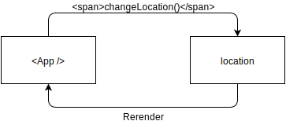
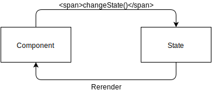
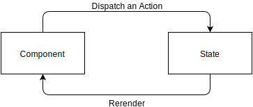

## State management with Redux

We've been using a top-level component called `App` to manage our global application state. That works fine for a small application, but as we add more and more functionality it becomes very tedious to work with.

Together with React, Facebook released something called Flux. Flux is a methodology that helps you manage your global application state. Flux works fine, but has the downside that it uses events, which can lead to quite a bit of confusion.

Thankfully, <a target="_blank" href="https://twitter.com/dan_abramov">Dan Abramov</a> stepped in and created Redux. Redux has the same core concept as Flux, but works without events, is much easer to understand and now basically the standard for application state management.

> Note: None of the following concepts and technologies are **necessary** to build a production app with react. Many people use them to their advantage, but they have some downsides too. (which we'll examine)

### The Concept

Remember the initial state of our `App` component? It looks like this:

```jsx
state = {
  return {
    location: '',
    data: {},
    dates: [],
    temps: [],
    selected: {
      date: '',
      temp: null
    }
  };
};
```

The object we return from this function is our entire application state. At the first start of our application, our state thus looks like this:

```jsx
{
  location: '',
  data: {},
  dates: [],
  temps: [],
  selected: {
    date: '',
    temp: null
  }
}
```

When users now change the location input field, the `location` field of our state changes:

```jsx
{
  location: 'Vienna, Austria',
  data: {},
  dates: [],
  temps: [],
  selected: {
    date: '',
    temp: null
  }
}
```

Instead of directly changing that location with `this.setState`, we'll call a function called `changeLocation` from our component. Redux will pick up that said function was called, do its magic and change the `location` field of our application state.

Now that the location is different and thus our application state has changed, our main `<App />` component will automatically rerender with the new data! (just like with component state)

The big advantage of this approach is that the component no longer needs to know how exactly we save the location. We could be persisting it as a coordinate, we could save it without whitespace, but the component doesn't have to care about that—the component only calls `changeLocation` and that's it! The application state is thus decoupled from the individual components.

This cycle of state management thus looks like this:



If we put this into more general terms, we call a function which changes something in the application state which rerenders some component:



We'll now need to introduce some terminology before we can finally start implementing this. This function that we call to change the application state is called an "action" in Redux, and we "dispatch" the "action". Let's change the cycle one last time with the terminology:



## Writing our first Redux parts

Let's write our first action! We'll start with the location field, since it's a very typical example. An action function in Redux returns an object with a `type` and can optionally also pass some data along the way. Our `changeLocation` action looks like this:

```jsx
function changeLocation(location) {
  return {
    type: 'CHANGE_LOCATION',
    location: location
  };
}
```

This action thus has a type of `'CHANGE_LOCATION'` and passes along some data with the `location` property.

That's nice and all, but this won't change the state automatically. We have to tell Redux what to do when this action comes in, which we do in a so-called reducer.

A reducer is a simple function that takes two arguments, the current state and the action that was dispatched:

```jsx
function mainReducer(state, action) {
  return state;
}
```

Right now, no matter what action comes in and what data it has the state will always stay the same – that's not quite optimal, as nobody will be able to work with the app! Let's change the `location` field in the state based on the data in the action with the `'CHANGE_LOCATION'` type.

```jsx
function mainReducer(state, action) {
  switch (action.type) {
    case 'CHANGE_LOCATION':
      state.location = action.location;
      return state;
  }
}
```

What we're doing here is _mutating_ the state. We assign `state.location` the value of `action.location`. This is discouraged by Redux because it introduces potential bugs and side effects. What we instead should be doing is _returning a new object_ which is a copy of the state!

JavaScript has a handy function called `Object.assign`, which allows you to do that. Let's take a look at the solution first:

```jsx
function mainReducer(state, action) {
  switch (action.type) {
    case 'CHANGE_LOCATION':
      return Object.assign({}, state, {
        location: action.location
      });
  }
}
```

By passing in a new, empty object (`{}`) as the first argument and the current `state` as the second one, we create a carbon copy of the state. The third argument of the function (`{ location: action.location }`) is _just the changes to our state_!

This creates a new object, meaning the state stays the same which is A+ behaviour and will keep us from a lot of bugs!

With a bit of glue this'll already work! We should do two more small things to make this better: we should return the state unchanged if no action we want to handle comes in and we should use the initial state if state is undefined:

```jsx
var initialState = {
  location: '',
  data: {},
  dates: [],
  temps: [],
  selected: {
    date: '',
    temp: null
  }
};

function mainReducer(state = initialState, action) {
  switch (action.type) {
    case 'CHANGE_LOCATION':
      return Object.assign({}, state, {
        location: action.location
      });
    default:
      return state;
  }
}
```

We'll now need to `dispatch` this action when the location changes:

```jsx
class App extends React.Component {
 fetchData = (evt) => { /* … */ };
 onPlotClick = (data) =>  { /* … */ };
 changeLocation = (evt) => {
   this.props.dispatch(changeLocation(evt.target.value));
 };
 render() { /* … */ }
});
```

> Don't worry about where `this.props.dispatch` comes from for now, we'll get to that!

Imagine `evt.target.value` is `"Sydney, Australia"`, this is what our global state is going to look like when we `dispatch` the `changeLocation` action:

```jsx
{
  location: 'Sydney, Australia',
  /* …the rest stays the same… */
}
```

## Tying it all together

Now that we understand the basic parts that are involved, let's tie it all together! First, we need to install two new modules:

```
npm install --save redux react-redux
```

> `redux` is the main package and is framework agnostic. `react-redux` provides bindings for react, as we'll see shortly!

Then we need to create a store for our state and provide the state to our root `App` component. The `store` combines all of the apps reducers and (as the name suggests) stores the state. Once the store is set up though, you can forget about it again since we'll be using the state, but not the store directly!

We do this in our main `index.js` file, and we'll use the `createStore` function from the `redux` package and the `Provider` component from the `react-redux` package.

First, `import` those functions:

index.js
```jsx

/* … */
import ReactDOM from 'react-dom';

import { createStore } from 'redux';

import { Provider } from 'react-redux';

import App from './App.js';
/* … */
```

Then we need to create our store:

index.js
```jsx

/* … */
import App from './App.js';

var store = createStore();

ReactDOM.render(
/* … */
);
```

Lastly, we need to wrap our `App` component in the `Provider` and pass in the store:

```jsx
/* … */
ReactDOM.render(
  <Provider store={store}>
  <App />
  </Provider>,
  document.getElementById('root')
);
/* … */
```

And that's it, our Redux integration is done! 🎉

Well, except it doesn't do anything yet. Let's create an `actions.js` file and put our `changeLocation` action from above inside:

actions.js
```jsx

function changeLocation(location) {
  return {
    type: 'CHANGE_LOCATION',
    location: location
  };
}
```

We'll want to import it in other files, so we need to `export` it for that to work:

actions.js
```jsx

export function changeLocation(location) {
  return {
  type: 'CHANGE_LOCATION',
  location: location
  };
}
```

Awesome, we've got our first action – now we need to add our reducer!

Same deal as with the action, add a `reducers.js` file and export our previously written reducer from there:

reducers.js
```jsx

var initialState = {
  location: '',
  data: {},
  dates: [],
  temps: [],
  selected: {
    date: '',
    temp: null
  }
};

export default function mainReducer(state = initialState, action) {
  switch (action.type) {
    case 'CHANGE_LOCATION':
      return {
        ...state,
        location: action.location
      }
    default:
      return state;
  }
}
```

> Having to use `Object.assign({}, state, {` for every action would be pretty verbose. Luckily we can use shorthand notation shown above.

> We export the reducer by default since it'll be the only thing we're exporting from that file

That's our reducer done,

Now we need to tell our store to use that reducer, so we `import` and pass it into the `createStore` call in the `index.js`:

index.js
```jsx

/* … */
import App from './App.js';

import mainReducer from './reducers';

var store = createStore(mainReducer);

ReactDOM.render(
/* … */
);
```

Awesome, now everything's wired up except our `App` component! We need to connect it to the global redux state, which the `react-redux` module thankfully has a handy function for. Instead of exporting the raw `App` component, we export the `connect`ed component:

App.js
```jsx

/* …more imports… */

import { connect } from 'react-redux';

/* … */

export default connect()(App);
```

While this is nice, we also need to tell `connect` that it should inject the `location` field we have in our reducer into this component. We do this by passing in a function as the first argument that takes the entire state, and then we return what we want to inject as props into our component. (this automatically injects `dispatch` to run our actions, which is why we can use `this.props.dispatch` in the `App` component)

App.js
```jsx

/* … */

export default connect(function (state) {
  return {
  location: state.location
  };
})(App);
```

This function is called `mapStateToProps`, let's make that an external function so it's a bit clearer:

App.js
```jsx

/* … */

function mapStateToProps(state) {
  return {
  location: state.location
  };
}

export default connect(mapStateToProps)(App);
```

And that's everything need to get our App to get the location from the Redux state! Let's adapt our `App` to get the location from the props:

App.js
```jsx

/* …more imports… */

import {
  changeLocation
} from './actions';

class App extends React.Component {
  fetchData = (evt) => {
    evt.preventDefault();

    var location = encodeURIComponent(this.props.location);

    /* … */
  };
  onPlotClick = (data) => { /* … */ };
  changeLocation = (evt) => {
  this.props.dispatch(changeLocation(evt.target.value));
  };
  render() {
  <div>
  {/* … */}
  <input
  placeholder={"City, Country"}
  type="text"
  value={this.props.location}
  onChange={this.changeLocation}
  />
  {/* … */}
  </div>
  }
}
```

That's everything needed to get the initial wiring done! Open this in your browser and change the location input, you should see the value adjusting – this means redux is working as expected!

## Wiring up the rest

Let's wire up some other actions, the goal here is to get rid of the entire component state of the `App` component! Let's take a look at the selected date and temperature. The first we'll write is the action `setSelectedTemp`, that pass on the value that it get passed in.

actions.js
```jsx

export function setSelectedTemp(temp, date) {
  return {
    type: 'SET_SELECTED_TEMP',
    temp: temp,
    date: date
  };
}

```

Nothing fancy here, standard actions like the `changeLocation` one.

Let's add that constant to our reducer, and also adjust the initial state a bit to include that field:

reducers.js
```jsx
export default function mainReducer(state = initialState, action) {
  switch (action.type) {
    case 'CHANGE_LOCATION':
      return {
        ...state,
        location: action.location
      };
    case 'SET_SELECTED_TEMP':
      return state;
    default:
      return state;
  }
}
```

Now our reducer just needs to return the changed state for that action:

reducers.js
```jsx

export default function mainReducer(state = initialState, action) {
  switch (action.type) {
    case 'CHANGE_LOCATION':
      return {
        ...state,
        location: action.location
      }
    case 'SET_SELECTED_TEMP':
      return {
        ...state,
        selected: {
          temp: action.temp,
          date: action.date
        }
      }
    default:
      return state
  }
}
```

Now let's wire it all up again in our `App` component:

App.js
```jsx

/* …more imports… */

import {
  changeLocation,
  setSelectedTemp
} from './actions';

class App extends React.Component{
  state = {
    return {
      data: {},
      dates: [],
      temps: [],
    };
  };

  fetchData = (evt) => {
    /* … */

      this.setState({
        data: body,
        dates: dates,
        temps: temps,
        selected: {
          date: '',
          temp: null
        }
      })

      this.props.dispatch(setSelectedTemp(null, ''));
    /* … */
  };
  onPlotClick = (data) => {
    if (data.points) {
      this.props.dispatch(setSelectedTemp(data.points[0].y, data.points[0].x));
    }
  };
  changeLocation = (evt) => { /* … */ };
  render() {
    /* … */
    return (
      {/* … */}
        <p className="temp-wrapper">
          <span className="temp">
            {this.props.selected.temp ? this.props.selected.temp : currentTemp}
          </span>
          <span className="temp-symbol">°C</span>
          <span className="temp-date">
            {this.props.selected.temp ? this.props.selected.date : ''}
          </span>
        </p>
      {/* … */}
    );
  }
}

function mapStateToProps(state) {
  return {
  location: state.location,
    selected: state.selected
  };
}
```

There are three more actions (and constants and reducer cases) that need to be implemented here: `setData`, `setDates` and `setTemps`. I'll leave it up to you here to implement them, taking inspiration from our already implemented actions!

----

Are you done? This is what your `App` component should look like now:

App.js
```jsx
import React, { Component } from 'react'
import { connect } from 'react-redux'
import xhr from 'xhr'
import './App.css'
import Plot from './Plot'

import {
  changeLocation,
  setData,
  setDates,
  setTemps,
  setSelectedTemp
} from './actions';


class App extends React.Component {

  fetchData = (evt) => {
    evt.preventDefault()

    var location = encodeURIComponent(this.props.location);
    var token = 'd6fa85d74f3520862d3ab7a86cb17108'
    var url = `http://api.openweathermap.org/data/2.5/forecast?q=${location}&APPID=${token}&units=metric`

    xhr({
      url: url
    }, (err, data) => {
      var body = JSON.parse(data.body)

      var list = body.list
      var dates = []
      var temps = []
      for (var i = 0; i < list.length; i++) {
        dates.push(list[i].dt_txt)
        temps.push(list[i].main.temp)
      }

      this.props.dispatch(setData(body))
      this.props.dispatch(setDates(dates))
      this.props.dispatch(setTemps(temps))
      this.props.dispatch(setSelectedTemp(null, ''))
    })
  }

  changeLocation = (evt) => {
      this.props.dispatch(changeLocation(evt.target.value))
  }

  onPlotClick = (data) => {
    if (data.points) {
      this.props.dispatch(setSelectedTemp(data.points[0].y, data.points[0].x));
    }
  }

  render() {
      var currentTemp = 'not loaded yet';
      if (this.props.data.list) {
        currentTemp = this.props.data.list[0].main.temp;
      }
      return (
        <div>
          <h1>Weather</h1>
          <form onSubmit={this.fetchData}>
            <label>I want to know the weather for
              <input
                placeholder={"City, Country"}
                type="text"
                value={this.props.location}
                onChange={this.changeLocation}
              />
            </label>
          </form>
          {/*
            Render the current temperature and the forecast if we have data
            otherwise return null
          */}
          {this.props.data.list ?
            <div className="wrapper">
              {/* Render the current temperature if no specific date is selected */}
              <p className="temp-wrapper">
                <span className="temp">
                  {this.props.selected.temp ? this.props.selected.temp : currentTemp}
                </span>
                <span className="temp-symbol">°C</span>
                <span className="temp-date">
                  {this.props.selected.temp ? this.props.selected.date : ''}
                </span>
              </p>
              <h2>Forecast</h2>
              <Plot
                xData={this.props.dates}
                yData={this.props.temps}
                onPlotClick={this.onPlotClick}
                type="scatter"
              />
            </div>
           : null}
        </div>
      );
  }
}

// Since we want to have the entire state anyway, we can simply return it as is!
function mapStateToProps(state) {
  return state;
}

export default connect(mapStateToProps)(App);

```

As you can see, everything is handled by our actions and reducer. Let's take a look at the reducer before we move on to make sure we're on the same page:

reducers.js
```js

var initialState = {
  location: '',
  data: {},
  dates: [],
  temps: [],
  selected: {
    date: '',
    temp: null
  }
};

export default function mainReducer(state = initialState, action) {
  switch (action.type) {
    case 'CHANGE_LOCATION':
      return {
        ...state,
        location: action.location
      }
      case 'SET_DATA':
        return {
          ...state,
          data: action.data
        }
      case 'SET_DATES':
        return {
          ...state,
          dates: action.dates
        }
      case 'SET_TEMPS':
        return {
          ...state,
          temps: action.temps
        }
    case 'SET_SELECTED_TEMP':
      return {
        ...state,
        selected: {
          temp: action.temp,
          date: action.date
        }
      }
    default:
      return state
  }
}

```

We still have that ugly `xhr({})` call in our `fetchData` function though. This works, but as we add more and more components to our application it'll become hard to figure out where what data is fetched.

That's why the redux community has adopted `redux-thunk` as a new standard for fetching data!

## `redux-thunk`

The idea behind `redux-thunk` is that we return a function from an action that gets passed `dispatch`. This allows us to do asynchronous things (like data fetching) in our actions:

```js
function someAction()
  // Notice how we return a function – this is what's called a "thunk"!
  return function thisIsAThunk(dispatch) {
    // Do something asynchronous in here
  }
}
```

### First implementation

Let's try to write an action called `fetchData` that fetches our data! Start with the basic structure:

actions.js
```js

/* …more actions here… */

export function fetchData() {
  return function thunk(dispatch) {
    // LET'S FETCH OUR DATA HERE
  }
}
```

Now let's copy and paste the `xhr` call from the `App` component and put it in there:

actions.js
```js

/* …more actions here… */

export function fetchData() {
  return function thunk(dispatch) {
    xhr({
      url: url
    }, (err, data) => {
      var body = JSON.parse(data.body)

      var list = body.list
      var dates = []
      var temps = []
      for (var i = 0; i < list.length; i++) {
        dates.push(list[i].dt_txt)
        temps.push(list[i].main.temp)
      }

      this.props.dispatch(setData(body))
      this.props.dispatch(setDates(dates))
      this.props.dispatch(setTemps(temps))
      this.props.dispatch(setSelectedTemp(null, ''))
    })
  }
}
```

Now we need to fix three things: 1) We need to import `xhr`, 2) we need to get the URL from the action and 3) we need to rename all `self.props.dispatch` calls to `dispatch`:

actions.js
```js

// REQUIRE xhr
import xhr from 'xhr';

/* …more actions here… */

// PASS URL IN HERE
export function fetchData(url) {
  return function thunk(dispatch) {
    xhr({
      url: url
    }, (err, data) => {

      var data = JSON.parse(data.body);
      var list = data.list;
      var dates = [];
      var temps = [];
      for (var i = 0; i < list.length; i++) {
        dates.push(list[i].dt_txt);
        temps.push(list[i].main.temp);
      }
      // RENAME this.props.dispatch TO dispatch
      dispatch(setData(data));
      dispatch(setDates(dates));
      dispatch(setTemps(temps));
      dispatch(setSelectedTemp(null, ''));
    });
  }
}
```

Well, that was easy! That's our thunked action done – let's call it from our `App` component:

App.js
```js
/* … */

class App extends React.Component {
  fetchData = (evt) => {
    evt.preventDefault();

    var location = encodeURIComponent(this.props.location);
    var token = 'd6fa85d74f3520862d3ab7a86cb17108'
    var url = `http://api.openweathermap.org/data/2.5/forecast?q=${location}&APPID=${token}&units=metric`

    this.props.dispatch(fetchData(url));
  },
  onPlotClick = (data) => { /* … */ },
  changeLocation = (evt) => { /* … */ },
  render() { /* … */ }
});

/* … */
```

That makes our `App` so much nicer to work with already!

### Wiring it up

The last step is wiring up `redux-thunk`. `redux-thunk` is a so-called "middleware". Middlewares sit in between the action and the reducers, every action you dispatch gets passed to all middlewares you add. (that's why they're called _middle_ ware)!

First, we need to install `redux-thunk`:

```Sh
npm install --save redux-thunk
```

Second, we need to `apply` the `thunk` middleware in our `createStore` call in `index.js`:

index.js
```jsx

/* … */
import { createStore, applyMiddleware } from 'redux';
import thunkMiddleware from 'redux-thunk';

/* … */

var store = createStore(
  mainReducer,
  applyMiddleware(thunkMiddleware)
);
/* … */
```

And that's it, everything should be working again now. Look how easy it is to handle our components, how nicely everything is separeted by concern and how easy it would be to add a new feature to our app! That's the power of redux, our application is easier to reason about and to handle, instead of having one massive top-level `App` component we separate the concerns properly.


## Additional Material

- <a href="http://redux.js.org" target="_blank">Official Redux Docs</a>
- <a href="http://staltz.com/unidirectional-user-interface-architectures.html#redux" target="_blank">André Staltz' Unidirectional User Interface Architectures</a>
- <a href="https://egghead.io/courses/getting-started-with-redux" target="_blank">Egghead.io "Getting started with Redux" Video Course</a>
- <a href="https://egghead.io/courses/building-react-applications-with-idiomatic-redux" target="_blank">Egghead.io Advanced Redux Video Course</a>
